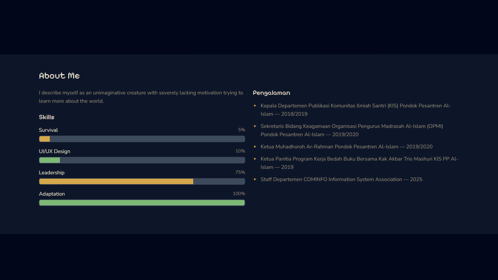
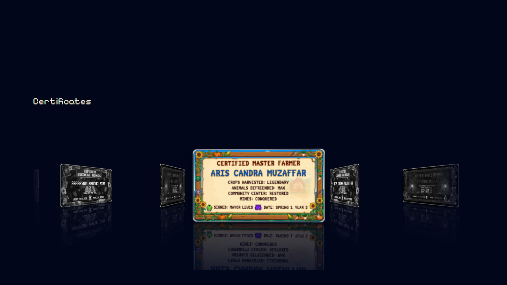

<a name="top"></a>

<p align="center">
  
  
  
  
</p>

<h1 align="center">Arcan Mz — Portfolio Dinamis</h1>
<p align="center">
  <i>Website portfolio satu halaman dengan tema Pixel Style Gimmick (Stardew Valley × Balatro) berbasis PHP + MySQL</i>
</p>

---

## 📚 Daftar Isi

- [Arcan Mz — Portfolio Dinamis](#arcan-mz--portfolio-dinamis)
  - [📚 Daftar Isi](#-daftar-isi)
  - [👤 Deskripsi](#-deskripsi)
  - [✨ Fitur](#-fitur)
  - [🛠 Stack Teknologi](#-stack-teknologi)
  - [📸 Tampilan Setiap Section](#-tampilan-setiap-section)
    - [Navbar \& Section Home (Awal — Plaster Tersembunyi)](#navbar--section-home-awal--plaster-tersembunyi)
    - [Section Home (Setelah Reveal)](#section-home-setelah-reveal)
    - [Section About Me](#section-about-me)
    - [Section Certificates](#section-certificates)
  - [📖 Penjelasan Kode](#-penjelasan-kode)
  - [🗃 Struktur Database](#-struktur-database)
  - [📁 Struktur Proyek](#-struktur-proyek)
  - [🚀 Cara Menjalankan (Laragon)](#-cara-menjalankan-laragon)

---

## 👤 Deskripsi

<p align="justify">Website portfolio dinamis untuk Mini Proyek 2 mata kuliah Pemrograman Berbasis Web. Semua data utama sekarang diambil dari database MySQL (bukan hardcoded langsung di file front-end), lalu dirender ke tampilan menggunakan PHP dan Vue.js.</p>

<p align="justify">Secara visual, proyek tetap mempertahankan identitas <strong>Pixel Style Gimmick</strong> yang terinspirasi Stardew Valley dan Balatro: warna gelap hangat, efek reveal interaktif, serta carousel sertifikat bergaya kartu.</p>

---

## ✨ Fitur

<p>
  
  
  
  
  
</p>

| Fitur                    | Keterangan                                                                                                                                                                                              |
| ------------------------ | ------------------------------------------------------------------------------------------------------------------------------------------------------------------------------------------------------- |
| **Data Dinamis**         | Profil, skills, pengalaman, dan sertifikat diambil dari database `minpro_portfolio`                                                                                                                   |
| **Section Home**         | Hero dengan plaster reveal 3× klik, tombol unlock section, serta efek parallax                                                                                                                        |
| **Section About Me**     | Deskripsi diri, progress bar skill, dan daftar pengalaman berbasis data tabel                                                                                                                          |
| **Section Certificates** | 3D Infinite Coverflow murni CSS, data gambar sertifikat diambil dari database                                                                                                                          |
| **Integrasi Laragon**    | Menyediakan file SQL siap import (`minpro_portfolio.sql`) dan konfigurasi koneksi default Laragon di `db.php`                                                                                          |

<details>
<summary><b>Detail interaksi khusus</b></summary>

- **No-scroll sampai klik:** halaman dikunci sampai tombol curious ditekan
- **Plaster reveal:** setiap blok konten perlu 3× klik sebelum terbuka
- **Secret found:** efek unlock glow setelah tombol ditekan
- **3D Coverflow:** animasi sertifikat berjalan murni CSS tanpa library slider

</details>

---

## 🛠 Stack Teknologi

<p>
  
  
  
  
</p>

| Teknologi       | Penggunaan                                                                                           |
| --------------- | ---------------------------------------------------------------------------------------------------- |
| **PHP 8+**      | Koneksi database, query data, dan serialisasi data ke JSON                                           |
| **MySQL**       | Penyimpanan data portfolio (`profil`, `skills`, `pengalaman`, `sertifikat`)                        |
| **Vue.js 3**    | Render data dinamis pada UI dan pengendalian interaksi                                               |
| **Bootstrap 5** | Layout responsif, grid, navbar, progress bar                                                         |
| **CSS3**        | Styling tema pixel, animasi, dan coverflow                                                           |

> Semua dependency front-end dimuat via CDN. Tidak perlu build tools.

---

## 📸 Tampilan Setiap Section

### Navbar & Section Home (Awal — Plaster Tersembunyi)

<div align="center">
  
</div>

<p align="justify">Tampilan awal menampilkan blok plaster tertutup dengan nuansa pixel-retro. Section lain belum dapat diakses sebelum tombol unlock ditekan.</p>

---

### Section Home (Setelah Reveal)

<div align="center">
  
</div>

<p align="justify">Setelah setiap plaster diklik 3×, konten nama, motto, dan deskripsi singkat akan tampil. Tombol curious membuka akses ke section berikutnya.</p>

---

### Section About Me

<div align="center">
  
</div>

<p align="justify">Section About menampilkan data deskripsi, skill, dan pengalaman yang seluruhnya berasal dari database.</p>

---

### Section Certificates

<div align="center">
  
</div>

<p align="justify">Sertifikat dirender ke slider 3D coverflow dengan animasi murni CSS (slide + scaleEffect) dan efek grayscale di sisi samping.</p>

<p align="center">
  <a href="https://dev.to/prahalad/3d-infinite-carouselcoverflow-slider-in-pure-css-with-reflection-4i9b">
    
  </a>
</p>

---

## 📖 Penjelasan Kode

<details>
<summary><h3>Penjelasan Kode</h3></summary>

**1. Data server-side di `index.php`**

- File `index.php` memanggil `db.php` untuk koneksi
- Query data dilakukan per domain: profil, skill, pengalaman, sertifikat
- Data dikirim ke front-end lewat objek JavaScript `serverData`

**2. Koneksi database di `db.php`**

- Menggunakan `mysqli`
- Charset diset ke `utf8mb4`
- Jika koneksi gagal, aplikasi menampilkan pesan error ramah pengguna

**3. Integrasi PHP + Vue**

- PHP menangani sumber data
- Vue mempertahankan interaktivitas UI (click reveal, navbar mobile, parallax)
- Pendekatan ini membuat tampilan tetap interaktif sambil data tetap dinamis

</details>

---

## 🗃 Struktur Database

Database: `minpro_portfolio`

| Tabel          | Fungsi                                                                 |
| -------------- | ---------------------------------------------------------------------- |
| `profil`       | Menyimpan data identitas utama portfolio                               |
| `skills`       | Menyimpan skill dan nilai persentase                                   |
| `pengalaman`   | Menyimpan daftar pengalaman                                            |
| `sertifikat`   | Menyimpan data sertifikat dan path gambar                              |

File SQL lengkap (schema + seed data):

- `minpro_portfolio.sql`

---

## 📁 Struktur Proyek

<details>
<summary><b>Lihat struktur folder</b></summary>

```text
minpro2/
├── index.php
├── db.php
├── style.css
├── minpro_portfolio.sql
├── INSTRUKSI_CLASSROOM.md
├── README.md
├── documentation/
│   ├── HOME - HIDDEN.png
│   ├── HOME - REVEAL.png
│   ├── ABOUT.png
│   └── CERTIFICATES.png
└── assets/
    ├── gua.png
    ├── ikon/
    │   ├── homepage.png
    │   ├── About Me.png
    │   ├── Certificates.png
    │   └── github.png
    └── serti/
        ├── gaya_balatro.png
        ├── gaya_dc.png
        └── gaya_stardew.png
```

</details>

---

## 🚀 Cara Menjalankan (Laragon)

<details>
<summary><b>Prasyarat</b></summary>

- Laragon (Apache + MySQL aktif)
- phpMyAdmin
- PHP 8+ (direkomendasikan)

</details>

1. **Pindahkan proyek ke web root**
   - Simpan folder `minpro2` di dalam folder `www` Laragon.
2. **Import database**
   - Buka `http://localhost/phpmyadmin`
   - Import file `minpro_portfolio.sql`
3. **Periksa koneksi**
   - Pastikan nilai di `db.php` sesuai setup lokal
4. **Jalankan aplikasi**
   - Akses `http://localhost/minpro2/index.php`

---

> [!NOTE]
> **Terima kasih telah membaca.**  
> *Vouloir, c'est pouvoir.*

---

<p align="center">
  <sub>Mini Proyek 2 PBW — Portfolio Dinamis</sub>
</p>

<p align="center">
  <a href="#top">⬆️ Kembali ke Atas</a>
</p>
